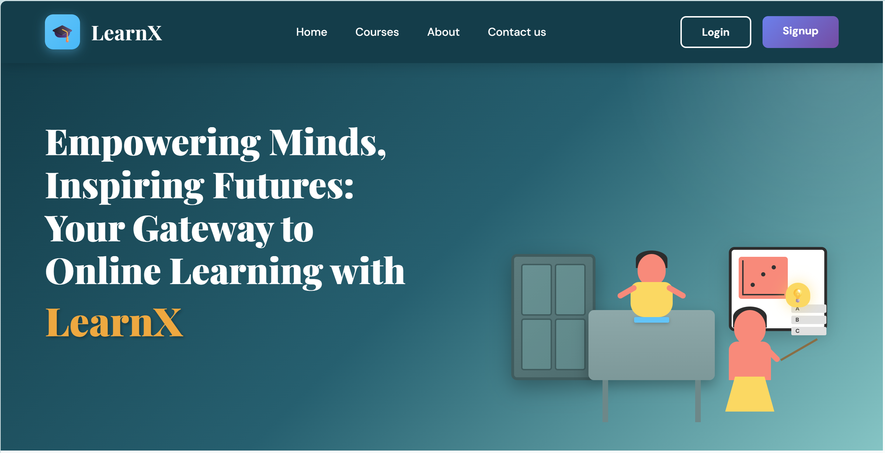
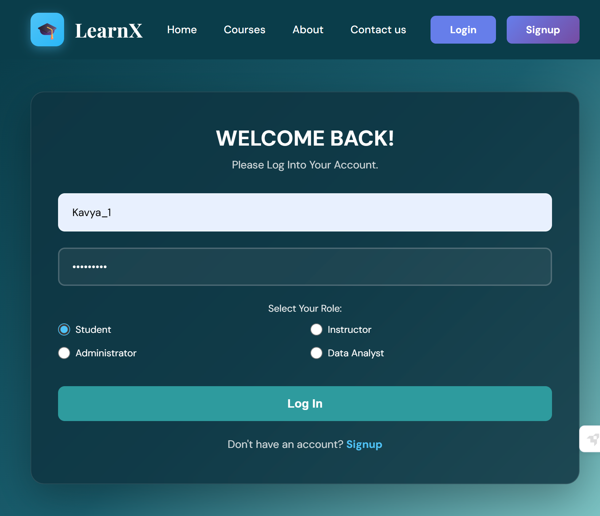
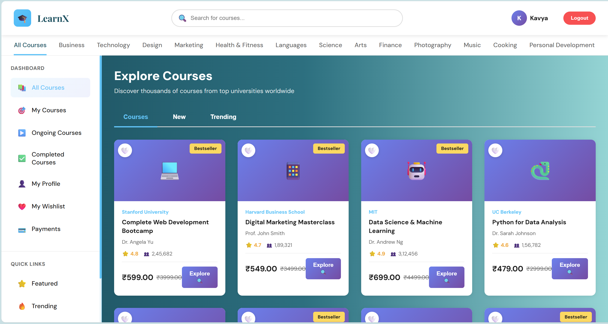
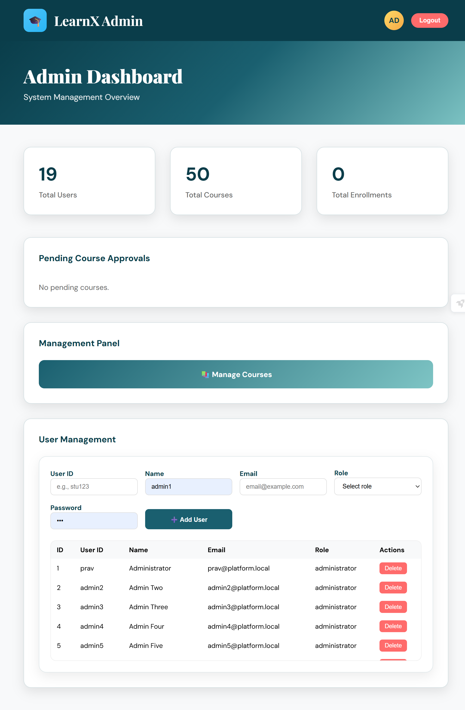
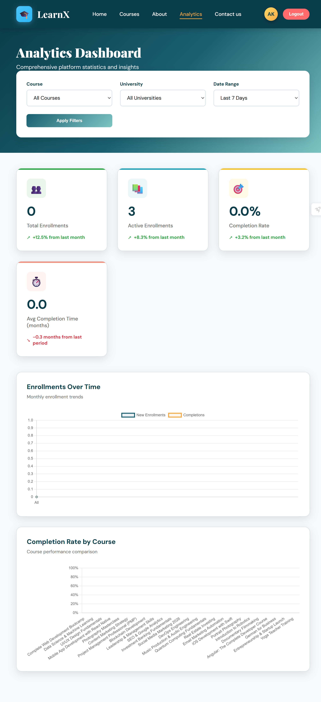

## Online Course Management Platform

A web-based information system for managing an online course platform.
The system supports multiple user roles — **administrator, instructor, student, and data analyst** — allowing the management of courses, users, enrollments, and analytics through a unified interface.

This project was developed as part of a **Database Management Systems laboratory assignment**, focusing on designing a relational database and integrating it with a full web-based system.

---

### Screenshots

#### Homepage



#### Login



#### Student Dashboard



#### Admin Dashboard



#### Analyst Dashboard



---

### Stack

* **Frontend**: HTML, CSS, JavaScript
* **Backend**: Node.js, Express
* **Database**: PostgreSQL

---

### Features

**Authentication**

* User registration and login.
* Role-based access control for different system users.

**Courses**

* Browse and search available courses.
* View course details and content.
* Register for courses.

**Instructor management**

* Instructors can manage assigned courses.
* Ability to add or update course content.

**Admin controls**

* Manage platform users.
* Assign instructors to courses.
* Add or remove students from the system.
* Manage course offerings.

**Analytics**

* Data analysts can view statistics related to course enrollments and platform usage.

---

### Architecture

```text
Client (HTML/CSS/JS)
        |
 REST API
        |
 Node.js + Express
        |
 PostgreSQL
```

---

### Database Design

The system uses **PostgreSQL** as the relational database for managing platform data.

The database schema models entities such as:

* Users
* Courses
* Instructors
* Students
* Enrollments
* Course content

During development we worked on:

* ER diagram design
* Relational schema creation
* Table relationships and normalization
* Writing SQL queries for data retrieval and updates
* Integrating PostgreSQL with the backend server

---

### Project structure

```text
online_course_platform/
├── backend
│   ├── db.js
│   ├── server.js
│   ├── routes.admin.js
│   ├── routes.auth.js
│   ├── routes.courses.js
│   ├── routes.instructors.js
│   └── routes.students.js
│
├── frontend
│   ├── js
│   ├── add_course.html
│   ├── admin-dashboard.html
│   ├── analyst-dashboard.html
│   ├── analyst-profile.html
│   ├── course-content.html
│   ├── course-page.html
│   ├── course.html
│   ├── courses.html
│   ├── index.html
│   ├── instructor-dashboard.html
│   ├── login.html
│   ├── manage-courses.html
│   ├── manage-users.html
│   ├── register.html
│   ├── signup.html
│   ├── student-dashboard.html
│   ├── student-profile.html
│   └── style.css
│
└── README.md
```

---

### Running locally

**Backend**

```bash
cd backend
npm install
node server.js
```

**Frontend**

Open `frontend/index.html` in your browser.

---

### Learning outcomes

Through this project we gained experience in:

* Designing relational databases using **PostgreSQL**
* Creating ER diagrams and relational schemas
* Writing SQL queries for real-world applications
* Building backend APIs with **Node.js and Express**
* Connecting frontend interfaces with backend services
* Developing a role-based web information system

---

### Group members

* Kavya Rai
* Pravallika C
* Bhumika Rishitha M
* Amrutha D
* Koncha Lavanya 
